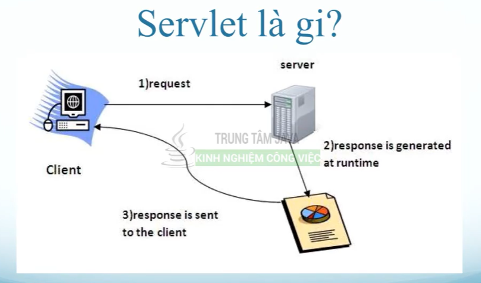
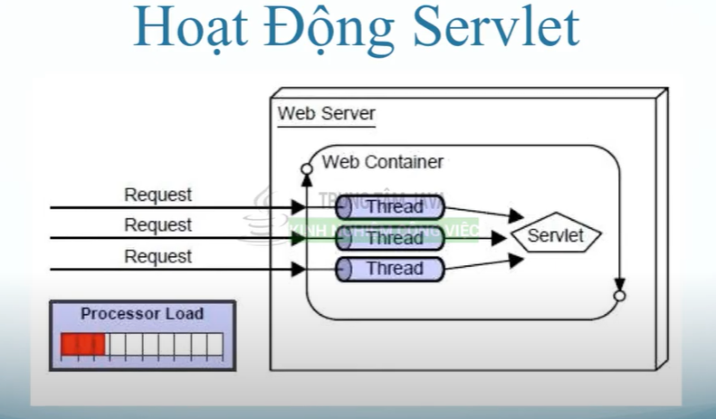
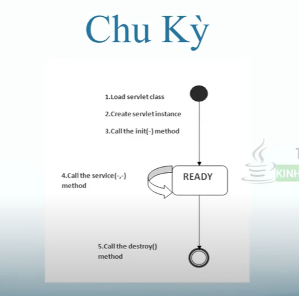
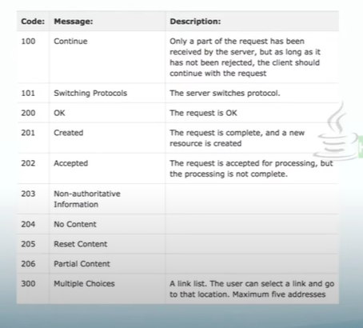
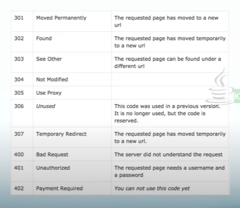
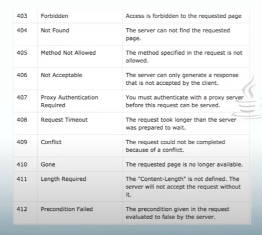
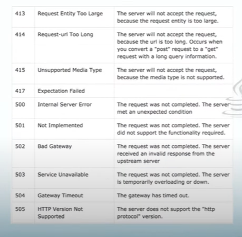
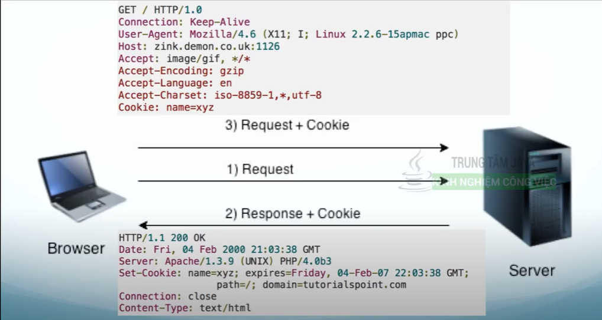
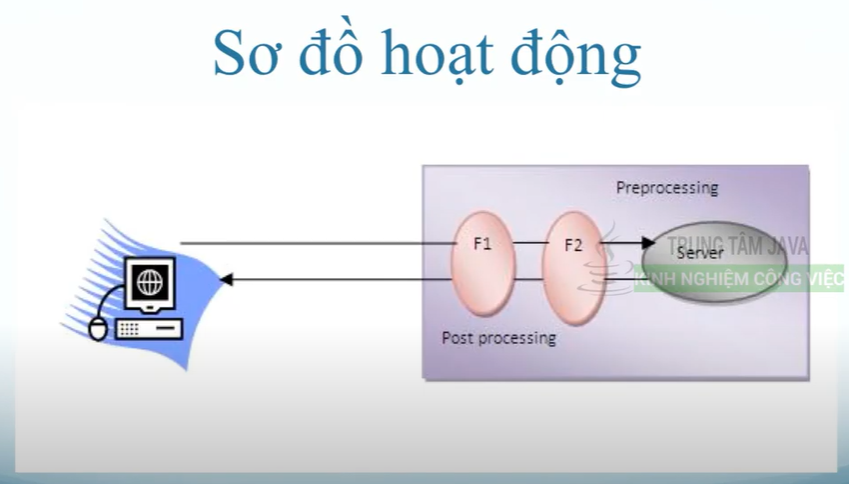

# 01 Giới thiệu về Java Servlet
- Là thư viện đầu tiên hỗ trợ viết web
- JSP hay các frameword khác hỗ trợ web thì đều biên dịch về Java Servlet và chạy trên máy ảo JVM
- Servlet là API của java để tạo các ứng dụng web
- Servlet hỗ trợ mạnh mẽ và chịu tải tốt
- Hỗ trợ nhiều interface và class trong lập trình web
  
  
- Điểm mạnh của servlet
  - Hiệu suất tốt: dùng thread cho mỗi request
  - Linh động: ngôn ngữ java
  - Mạnh mẽ: JVM quản lí bộ nhớ, xoá rác
  - Bảo mật: bảo mật của java
- Web Terminology
  - Static web: là trang web html nội dung cố định
  - Dynamic web: là trang web nội dung động theo thời gian
  - HTTP: là giao thức mạng dùng cho web
  - Request/Response: yêu cầu gửi đi/kết quả trả về
  - GET, POST, PUT, DELETE, HEAD: là các hình thức gửi dữ liệu từ client lên server từ trình duyệt
  - Content-type: là nội dung như text, hình ảnh, media
  - Web server: dùng chạy web, quản lí tài nguyên web, các request/response...
# 02 Cài đặt Tomcat - Servlet
# 03 Chu kỳ sống của Servlet
- Servlet là cách gọi tắt của đối tượng servlet trong bộ nhớ heap
  
- Khi request đầu tiên gửi đến, servlet sẽ được init
- Khi servlet đã sẵn sàng, sẽ gọi service method để lắng nghe các request và trả về response cho client
# 04 Cấu hình Java Servlet bằng XML
# 05 Cấu hình Java Servlet bằng Java Annotation
# 06 ServletRequest trong Java Servlet
- ServletRequest chứa thông tin từ client gửi lên server
# 07 ServletResponse trong Java Servlet
- ServletResponse dùng để trả kết quả server về client
# 08 ServletConfig trong Java Servlet
# 10 HTTP Response Code trong Java Servlet
  
  
  
  
# 11 Đọc dữ liệu gửi lên từ client qua URL trong Java Web
# 12 Đọc dữ liệu từ POST và GET trong HTML Form trong Java Servlet
# 13 Redirect Chuyển hướng trang web trong Java Servlet
# 14 Java Servlet Cookies
- Cookies là một file text luư ở phía browsers của client
- Cookie lưu thông tin dạng key/value
- Request sẽ gửi thông tin Cookies trong header mỗi lần gọi
- Java servlet hỗ trợ HTTP cookie
- Có thời gian sống nhất định
  
# 14 Login sử dụng Servlet Cookie
# 15 Java Servlet Session
- Session giúp duy trì trạng thái của dữ liệu của người dùng
- Session có 1 thời gian sống xác định
- Servlet quản lý bằng Session Management
- Session lưu thông tin dạng key/value trên server
- Cách hoạt động
  - Cookies: set ID vào cookie để nhận dạng
  - Hidden field trong form: set ID vào 1 trường ẩn trong form (<input type='hidden' name='sessionid' value='12345' />)
  - URL rewriting: http://abc.com/file.html;sessionid=12345
- HttpSession
  - Là một interface trong Servlet giúp lưu thông tin người dùng qua các servlet khác nhau
```java
  HttpSesstion session = req.getSession();
```
# 16 Java Servlet Filter
- Filter là một đối tượng dùng để xử lý request trước khi gọi đến một servlet đích, và response trả về kết quả từ servlet
- Dùng nhiều filter một lúc
- Dễ dàng tích hợp bất cứ lúc nào
  
- Tác dụng của filter
  - Logging
  - Check ip
  - Nén file
  - Validate dữ liệu
  - ...
# 17 Java Servlet Filter dùng XML config
# 18 Java Servlet Filter sử dụng Java config (Annotation)
# 19 Java Servlet Filter tính số lượt truy cập website
# 20 Java Servlet FilterConfig
- Dùng để đọc giá trị bắt đầu của filter
# 21 ServletContext trong Java Servlet
- Lưu thông tin của website (toàn bộ servlet)
# 22 Auto Refresh - Tự động làm mới trang Java Servlet
# 23 Thẻ welcome file list trong web.xml của Java Servlet
- Dùng để cấu hình các file bắt đầu của servlet
# 24 Cách deploy một Java Servlet bằng file war
- war file bao gồm tất cả các file của project được nén lại
# 25 Java Servlet - Bắt lỗi xảy ra về trang thân thiện trong Java Servlet